# **Deployment Process:**

## Install Aidlux

Download AidLux from my GoogleDrive link: [Aidlux](https://drive.google.com/file/d/1IYng4KFQ5JT4cE2TD5mPKnLmN_Ld39z0/view?usp=drive_link) , and install it on Android device.

Open the mobile version of AidluxAPP, the first time you enter, the system that comes with the app will be initialised.

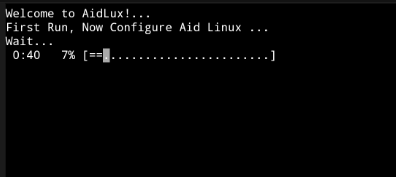

After initialisation is complete enter the Aidlux interface:

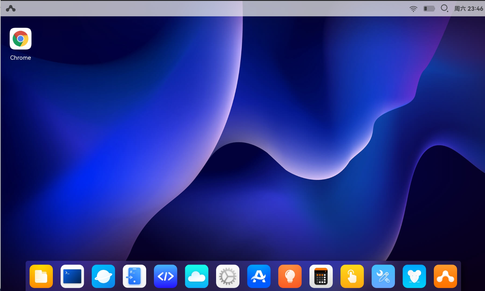

## Uploading files

Click on cloud_ip in AidLux to display the network IP address

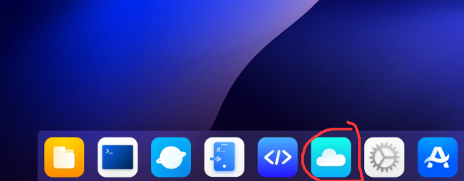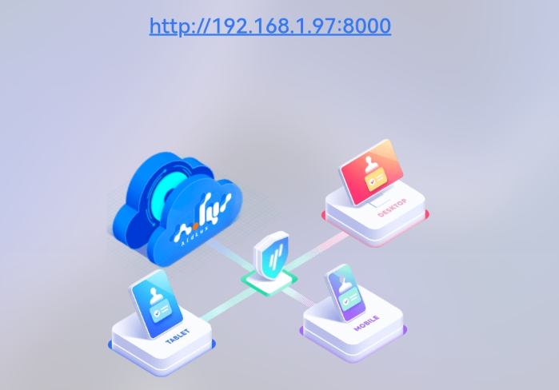

The mobile phone can be accessed by entering the IP address in the computer browser, the mobile phone and the computer must be in the same LAN (the initial password for login is ***aidlux***)

Click on the folder to upload the code from my github

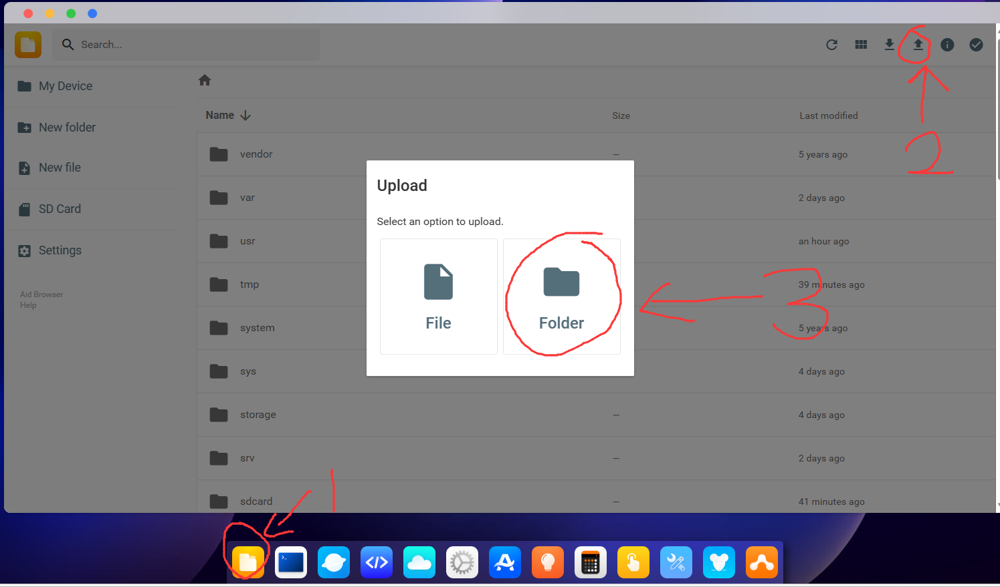

## PC remote debugging AidLux using vscode

Install Visual Studio Code, ref: [How to Install Visual Studio Code on Windows? - GeeksforGeeks](https://www.geeksforgeeks.org/how-to-install-visual-studio-code-on-windows/)

To install Remote SSH in vscode, click on Remote SSH on the left side of Vscode against the pop-up and click Install.

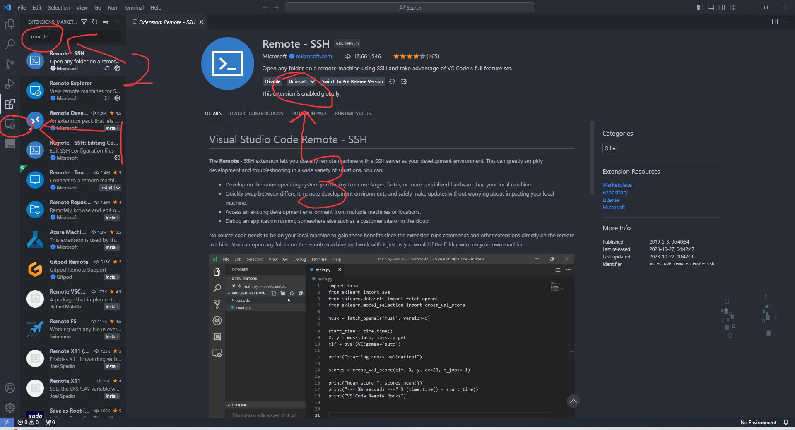

Click on the Remote Debugging button in the lower left corner, and then click on "connect to Host".

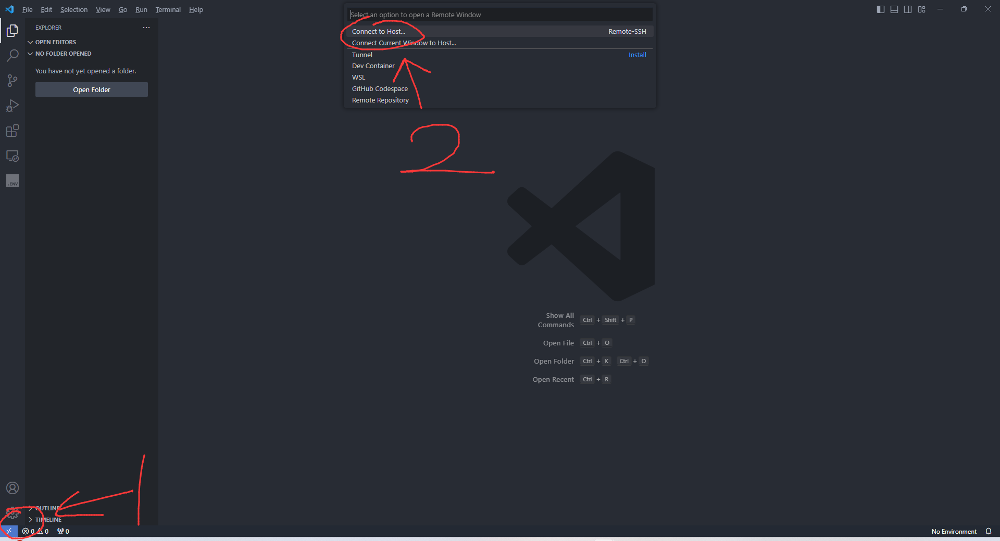

Then click "Configure SSH Hosts...". and select the config file in the "Users" folder.

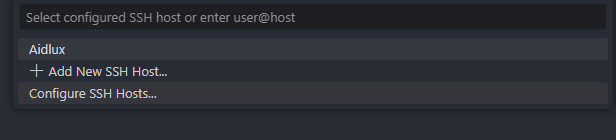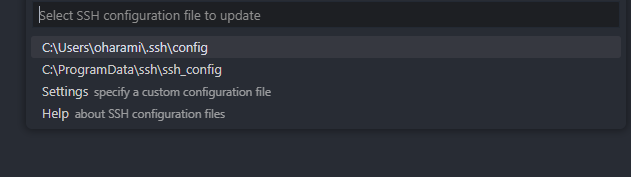

Edit the file according to the previous ip address, the port needs to be entered as 9022

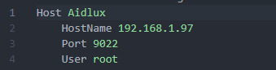

After saving, an SSH server will be created on the left side, click "Connect to Host in New Window".

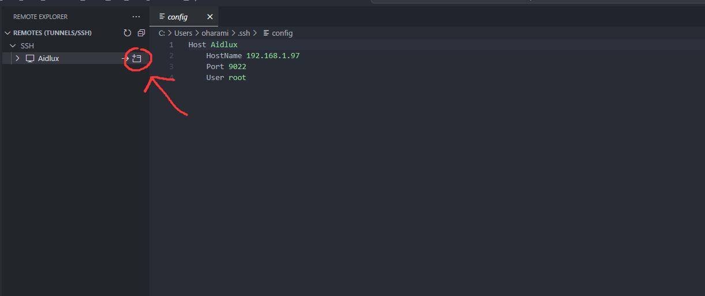

Click on the window, the pop-up interface select "Linux", select continue, and then enter the initial password above. When "SSH Aidlux" is displayed in the lower left corner, the connection is successful.

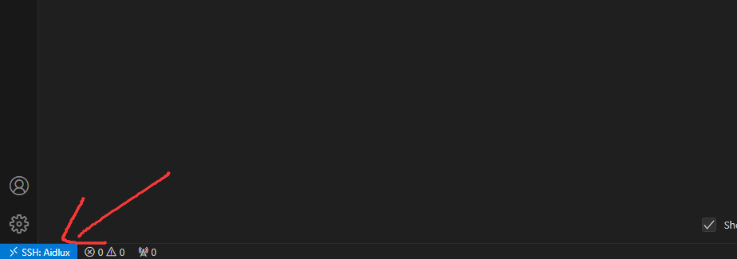

Click Open Folder to locate the uploaded code folder.

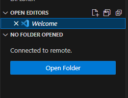

Run "pedestrian_detection.py", then the system is successfully deployed on the mobile phone.

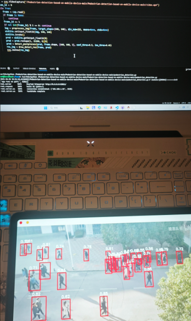
